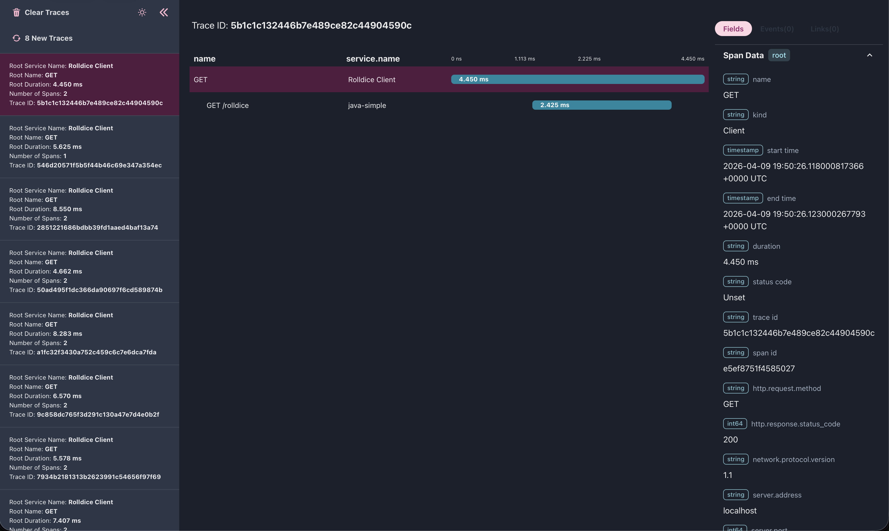
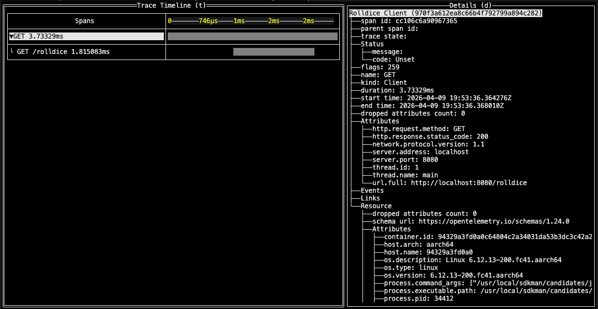
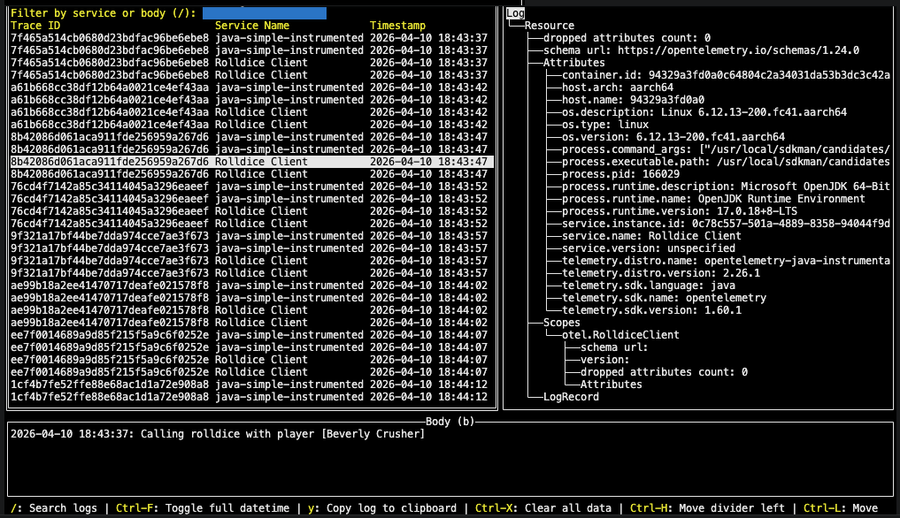
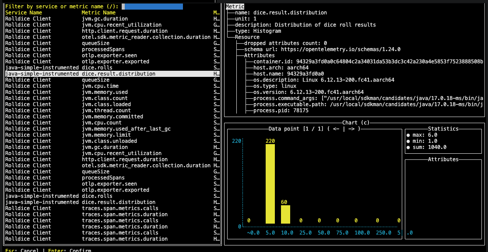
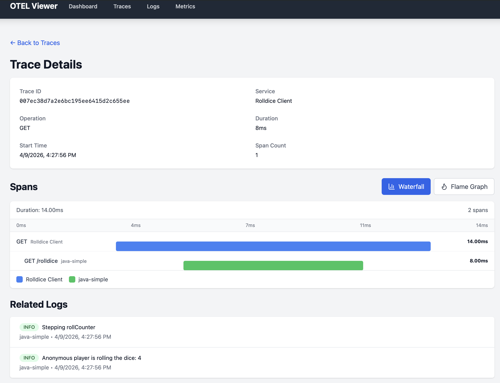
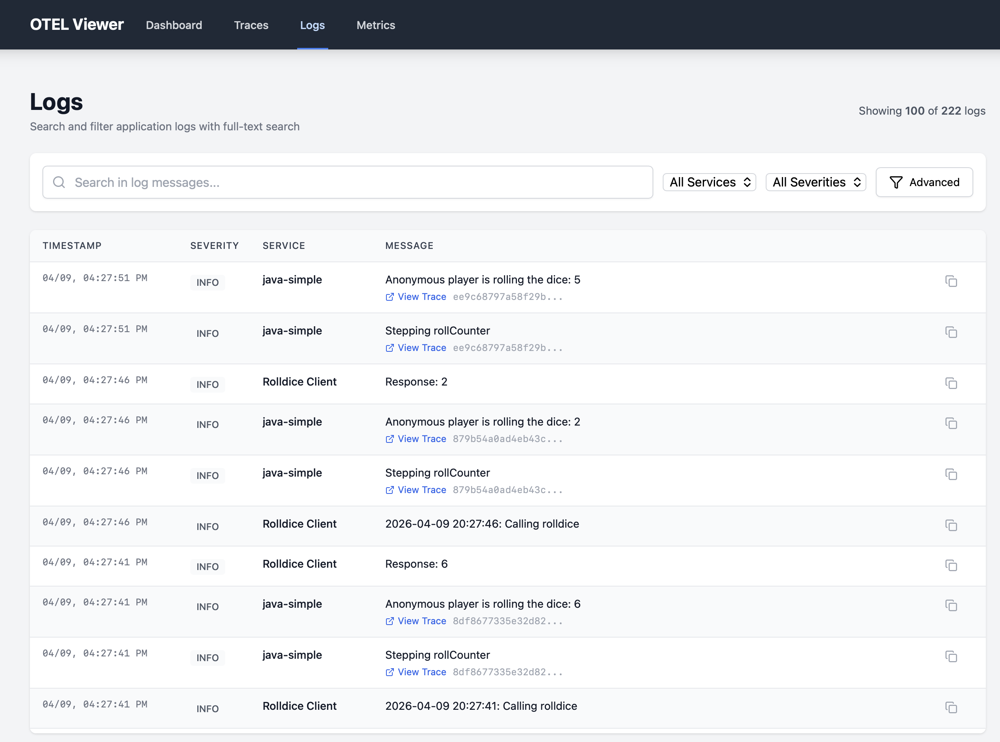
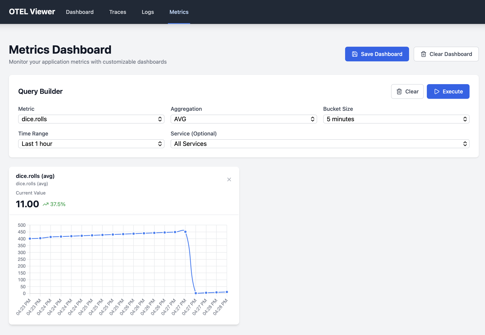

# Simple OTel Instrumentation Java Example for Developers

This is a companion repository for Devoxx Greece 2026 talk, "The Lazy Developer’s Guide to Observing Your Own Code"

Java source code courtesy of [mviitane/otel-java-simple](https://github.com/mviitane/otel-java-simple)

Additional reference at [opentelemetry.io getting started guide for Java](https://opentelemetry.io/docs/languages/java/getting-started/)

## Quickstart

1- Build the Java project

Do this the first time you run the project, or after any code changes.

Open up a new terminal window and run:

```bash
./scripts/00-build-java.sh
```

2- Run the OTel Collector

Open up a new terminal window and run:

```bash
docker compose up otel-collector
```

3- Run the Java example

Start up the Java server in a new terminal window:

```bash
./scripts/02-run-java-server.sh
```

Call the `/rolldice` endpont in a new terminal window:

```bash
./scripts/04-run-java-client.sh
```

4- Run the [OTel Desktop Viewer](https://github.com/CtrlSpice/otel-desktop-viewer)

Start up the OTel Desktop Viewer container in a new terminal window:

```bash
docker compose up otel-desktop-viewer
```

The app will be available at `http://localhost:8000`. If you're running this in a dev container, you may need to manually forward port `8000` inside the container, if it's not automatically done for you.



> **NOTES:** 
> 1- The OTel Desktop Viewer only works for rendering OTel traces.
> 2- If you configure logs and metrics, not only will you get a stack trace, the app will also fail to start up properly

5- Run [otel-tui](https://github.com/ymtdzzz/otel-tui)

Start up the `otel-tui` container in a new terminal window, in daemon mode:

```bash
docker compose up otel-tui -d
```

Start up the UI:

```bash
docker compose attach otel-tui
```

Unlike the OTel Desktop Viewer, `otel-tui` supports traces:



logs:



and metrics:



6- Run [OTel Front](https://github.com/mesaglio/otel-front)

Start up the `otel-front` container in a new terminal window, in daemon mode:

```bash
docker compose up otel-front
```

The app will be available at `http://localhost:8001`. If you're running this in a dev container, you may need to manually forward port `8001` inside the container, if it's not automatically done for you.

Just like with `otel-tui`, OTel Front also supports traces:



logs:



and metrics:


